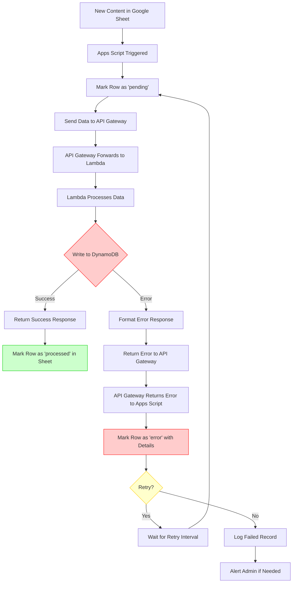
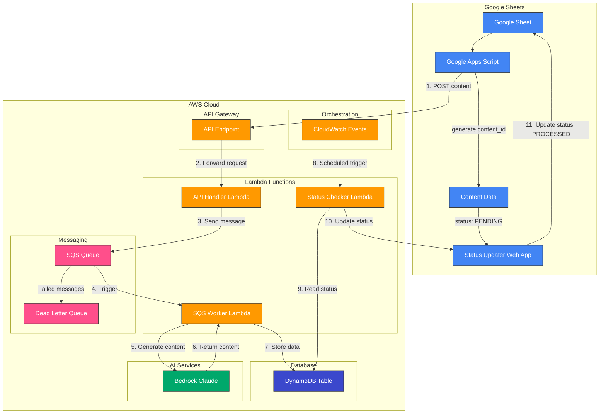
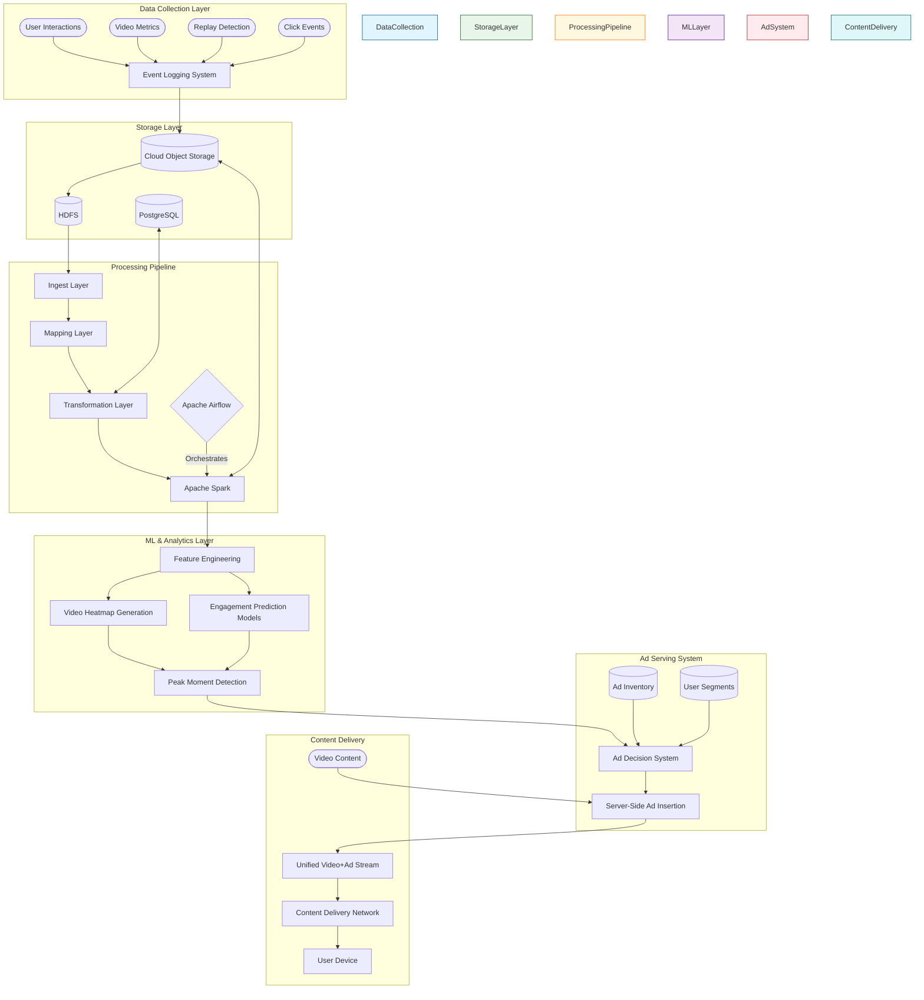

# Content Processor Lambda Function

This Lambda function processes content from Google Sheets and stores it in DynamoDB.

```mermaid
flowchart TD
    A[New Content in Google Sheet] --> B[Apps Script Triggered]
    B --> C[Mark Row as 'pending']
    C --> D[Send Data to API Gateway]
    D --> E[API Gateway Forwards to Lambda]
    E --> F[Lambda Processes Data]
    F --> G{Write to DynamoDB}
    
    G -->|Success| H[Return Success Response]
    H --> I[Mark Row as 'processed' in Sheet]
    
    G -->|Error| J[Format Error Response]
    J --> K[Return Error to API Gateway]
    K --> L[API Gateway Returns Error to Apps Script]
    L --> M[Mark Row as 'error' with Details]
    M --> N{Retry?}
    
    N -->|Yes| O[Wait for Retry Interval]
    O --> C
    
    N -->|No| P[Log Failed Record]
    P --> Q[Alert Admin if Needed]

    style G fill:#ffcccc,stroke:#ff0000
    style N fill:#ffffcc,stroke:#ffcc00
    style I fill:#ccffcc,stroke:#00cc00
    style M fill:#ffcccc,stroke:#ff0000
```

```mermaid
graph TD
    subgraph "Google Sheets"
        GS[Google Sheet] --> GSA[Google Apps Script]
        GSA --> |generate content_id| CD[Content Data]
        CD -->|status: PENDING| SU[Status Updater Web App]
    end

    subgraph "AWS Cloud"
        subgraph "API Gateway"
            APIG[API Endpoint]
        end
        
        subgraph "Lambda Functions"
            AHL[API Handler Lambda]
            SWL[SQS Worker Lambda]
            SCL[Status Checker Lambda]
        end
        
        subgraph "Messaging"
            SQS[SQS Queue]
            DLQ[Dead Letter Queue]
        end
        
        subgraph "Database"
            DDB[DynamoDB Table]
        end

        subgraph "Orchestration"
            CWE[CloudWatch Events]
        end
        
        subgraph "AI Services"
            BDB[Bedrock Claude]
        end
    end

    %% Data flow
    GSA -->|1. POST content| APIG
    APIG -->|2. Forward request| AHL
    AHL -->|3. Send message| SQS
    SQS -->|4. Trigger| SWL
    SWL -->|5. Generate content| BDB
    BDB -->|6. Return content| SWL
    SWL -->|7. Store data| DDB
    SQS -->|Failed messages| DLQ
    CWE -->|8. Scheduled trigger| SCL
    SCL -->|9. Read status| DDB
    SCL -->|10. Update status| SU
    SU -->|11. Update status: PROCESSED| GS

    classDef google fill:#4285F4,stroke:#333,stroke-width:1px,color:white;
    classDef aws fill:#FF9900,stroke:#333,stroke-width:1px,color:white;
    classDef lambda fill:#FF9900,stroke:#333,stroke-width:1px,color:white;
    classDef db fill:#3B48CC,stroke:#333,stroke-width:1px,color:white;
    classDef queue fill:#FF4F8B,stroke:#333,stroke-width:1px,color:white;
    classDef ai fill:#00A86B,stroke:#333,stroke-width:1px,color:white;

    class GS,GSA,CD,SU google;
    class APIG,AHL,SWL,SCL,CWE aws;
    class AHL,SWL,SCL lambda;
    class DDB db;
    class SQS,DLQ queue;
    class BDB ai;
```

```mermaid
flowchart TB
    subgraph "Data Collection Layer"
        style DataCollection fill:#e1f5fe,stroke:#01579b
        UserInteractions([User Interactions]) --> EventLogging[Event Logging System]
        VideoMetrics([Video Metrics]) --> EventLogging
        Replay([Replay Detection]) --> EventLogging
        ClickEvents([Click Events]) --> EventLogging
    end

    subgraph "Storage Layer"
        style StorageLayer fill:#e8f5e9,stroke:#1b5e20
        EventLogging --> RawStorage[(Cloud Object Storage)]
        RawStorage --> HDFS[(HDFS)]
        PostgreSQL[(PostgreSQL)]
    end

    subgraph "Processing Pipeline"
        style ProcessingPipeline fill:#fff8e1,stroke:#ff6f00
        HDFS --> IngestLayer[Ingest Layer]
        IngestLayer --> MappingLayer[Mapping Layer]
        MappingLayer --> TransformationLayer[Transformation Layer]
        TransformationLayer --> SparkProcessing[Apache Spark]
        Airflow{Apache Airflow} --> |Orchestrates| SparkProcessing
    end

    subgraph "ML & Analytics Layer"
        style MLLayer fill:#f3e5f5,stroke:#4a148c
        SparkProcessing --> FeatureEngineering[Feature Engineering]
        FeatureEngineering --> EngagementModels[Engagement Prediction Models]
        FeatureEngineering --> HeatmapGeneration[Video Heatmap Generation]
        HeatmapGeneration --> PeakDetection[Peak Moment Detection]
    end

    subgraph "Ad Serving System"
        style AdSystem fill:#ffebee,stroke:#b71c1c
        PeakDetection --> AdDecisionSystem[Ad Decision System] 
        AdInventory[(Ad Inventory)] --> AdDecisionSystem
        UserSegments[(User Segments)] --> AdDecisionSystem
        AdDecisionSystem --> SSAI[Server-Side Ad Insertion]
    end

    subgraph "Content Delivery"
        style ContentDelivery fill:#e0f7fa,stroke:#006064
        VideoContent([Video Content]) --> SSAI
        SSAI --> UnifiedStream[Unified Video+Ad Stream]
        UnifiedStream --> CDN[Content Delivery Network]
        CDN --> UserDevice[User Device]
    end

    %% Cross-connections
    PostgreSQL <--> TransformationLayer
    RawStorage <--> SparkProcessing
    EngagementModels --> PeakDetection
```